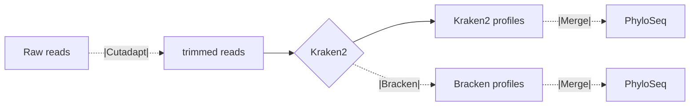

# HPC_KrakenFor16S
 Bash pipeline for 16S taxonomic profiling using Kraken2. Developed for NBI cluster (SLURM scheduler).

 ## Pipeline overview:
 The pipeline takes raw or QC'd amplicon reads and run Kraken2 and optionally Bracken for rapid taxonomic profiling. An optional merging step will parse the Kraken2/Bracken output and generate a PhyloSeq object.

Note that the pipeline takes paired end files that follow the naming convention: 
- PAIR1 = ${FILE}_R1_001.fastq.gz
- PAIR2 = ${FILE}_R2_001.fastq.gz



 ## To dos:
 	- Add merging a parsing Bracken outputs 

 ## Requirements
 This pipeline requires:

 	- Kraken2 v2.1.3
 	- Bracken v2.9
 	- Cutadapt v4.7
 	- R v4.2.1 (and the Phyloseq, tidyverse and r-argparse packages)

The required tools can be installed using conda and the provided .yml environment description.

```
conda env create -f KrakenFor16S.yml
```

## Run the pipeline

### Edit the config.sh file 
Select the steps to run and specify the input and output folder.

### activate the conda environment and run script

```
conda activate KrakenFor16S
bash run_KrakenFor16S.sh
```

